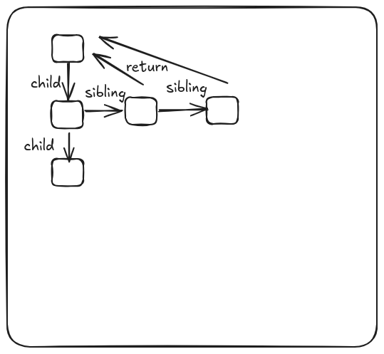

# React Fiber Theory: Understanding React's Core Engine

React Fiber is a **re-implementation of React's core reconciliation algorithm**. It's not a feature you directly interact with, but rather the internal engine that powers React's performance, concurrency features, and the foundation for Hooks and Suspense. It was introduced with React 16.

## 🧐 The Problem with the Old Reconciliation (Stack Reconciler)

Before Fiber, React used a "stack reconciler" that had significant limitations for complex applications:

*   **Synchronous and Uninterruptible:** Once a rendering update began, it processed the entire component tree (or a large portion of it) in one continuous, blocking operation.
*   **Blocking Main Thread:** Long-running updates would block the browser's main thread, leading to a frozen UI, dropped frames (jank), and a poor user experience, especially on slower devices.
*   **No Prioritization:** All updates were treated equally. A critical animation update would have to wait behind less urgent data updates.

## ✨ The Core Idea of Fiber

Fiber was designed to address these issues by making the reconciliation process **asynchronous** and **interruptible**.

### 1. Fibers as Units of Work

*   Instead of a monolithic component tree, Fiber breaks down the rendering work into individual, small units called **Fibers**.
*   A **Fiber** is a plain JavaScript object representing a React element, a component instance, or a host DOM element (`
`, ``, etc.).
*   Each Fiber also stores information about its parent, child, and sibling, forming a **linked list-like data structure** that can be efficiently traversed and manipulated.

### 2. Work in Progress (WIP) Tree

React always maintains two trees in memory:

*   **Current Tree:** Represents the currently rendered UI that is visible on the screen.
*   **Work-in-Progress (WIP) Tree:** This is where React builds and processes the next version of the UI.
*   When an update is triggered, React starts constructing the WIP tree by cloning or creating new Fibers based on the changes.

### 3. Prioritization and Scheduling (Scheduler)

*   Fiber allows React to **prioritize** different types of updates. For instance, user input (e.g., typing) or animation updates can be given higher priority than a background data fetch.
*   React can now **pause and resume** work on the WIP tree. It collaborates with the browser's `requestIdleCallback` (or an equivalent internal scheduler) to perform reconciliation work in small chunks during idle periods, without blocking the main thread.
*   If a higher-priority update arrives while lower-priority work is in progress, React can *stop* the current work, immediately start on the higher-priority update, and then potentially discard or resume the paused work later.

### 4. Two-Phase Reconciliation

Fiber divides the reconciliation process into two distinct phases:

#### a. Render/Reconciliation Phase (Asynchronous and Interruptible)

*   **What it does:** React traverses the Fiber tree, performs the diffing (comparing old and new props/state), and calculates the necessary DOM changes.
*   **Key characteristic:** This work can be **paused, resumed, or even aborted**.
*   **Important:** **No DOM changes occur in this phase.** Side effects (like `useEffect` with no dependency array) are *not* called here. This is crucial because if the work is interrupted and discarded, these side effects should not have run yet.

#### b. Commit Phase (Synchronous and Uninterruptible)

*   **What it does:** Once the render phase completes and React has a complete list of all necessary DOM mutations (insertions, deletions, updates), it enters the commit phase. React then rapidly applies all the calculated changes to the actual DOM.
*   **Key characteristic:** This phase is **synchronous** and **uninterruptible**.
*   **Important:** This is when actual **side effects** (`useEffect` cleanup and execution, `componentDidMount`, `componentDidUpdate`, `componentWillUnmount`) are triggered. Because it's synchronous and typically very fast (only applying already computed changes), it minimizes the time the main thread is blocked.

## 🚀 Key Benefits of React Fiber

1.  **Improved Responsiveness (Concurrency):**
    *   The most significant advantage. React can schedule and prioritize work, leading to smoother animations, more responsive UIs, and less "jank."
    *   Enables **Time Slicing**, where React can break up long-running render tasks into smaller chunks, allowing the browser to render other things in between.
    *   Enables **Suspense**, allowing React to pause rendering parts of the UI while waiting for data (or code) to load, showing a fallback in the meantime.

2.  **Error Boundaries:**
    *   Fiber's ability to gracefully catch errors during the render phase and recover by rendering an alternative UI is a direct benefit of its architecture.

3.  **New Lifecycle Methods & Hooks:**
    *   Lifecycle methods like `getDerivedStateFromProps` and `getSnapshotBeforeUpdate`, and hooks like `useEffect` and `useLayoutEffect`, are specifically designed to work within Fiber's two-phase rendering model.
    *   `useEffect` runs *after* the commit phase (non-blocking), while `useLayoutEffect` runs *synchronously during* the commit phase (blocking, for DOM measurements that require layout information).

4.  **Enhanced Developer Experience:**
    *   Although you don't directly manipulate Fibers, the performance improvements and new features (like Suspense and Concurrent Mode) lead to a better experience for developers building complex and highly interactive applications.

## 💡 Analogy

Imagine a busy restaurant kitchen:

*   **Old React:** Was like a single chef trying to prepare every order one by one, from start to finish, without any breaks. If a VIP order came in, they'd have to finish the current meal first. This could lead to long waits and frustrated customers.
*   **React Fiber:** Is like a team of chefs who break down tasks into smaller steps. They can pause working on a complex dish, quickly prepare a high-priority "snack" for a waiting customer, and then seamlessly return to the complex dish, ensuring no customer waits too long and everyone gets served efficiently.

In essence, React Fiber is the foundational overhaul that enables React to be more efficient, responsive, and adaptable to modern web application demands, laying the groundwork for many powerful features we see today.

## Resouces
* https://www.youtube.com/watch?v=0ympFIwQFJw
* https://www.youtube.com/watch?v=ZCuYPiUIONs
*
